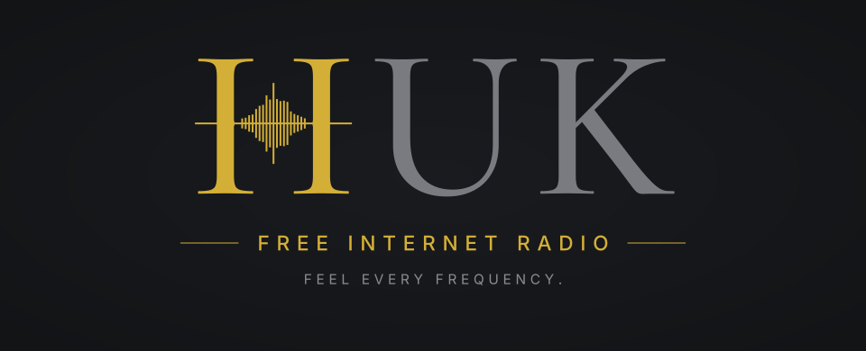

  

# HUK

A free, non-commercial, international 24/7 internet radio for music that authors publish
themselves — with AI-assisted moderation and transparent, deterministic charts.

> **Status: pre-alpha (v2 rewrite).** The earlier prototype is preserved at the git tag
> `prototype-v0.2.1` and must not be deployed.

## What it is
- One shared timeline: everyone hears the same moment. Plays on a locked screen (PWA).
- Authors keep their files. HUK links to them (Audius or author-hosted URLs) and stores only metadata and hashes.
- Listeners like tracks (public) and dislike privately (ranking signal only), build personal playlists, comment.
- Weekly top-100 charts by language, style, direction, and instrumental.
- Moderation targets blatant crime and nastiness only; AI triages, humans decide the hard cases.
- No ads. No payouts. Donations (if any) support the software developer, not the station.

## How the project is run
| File | Purpose |
|---|---|
| [`AGENTS.md`](AGENTS.md) | Method for the coding agent: roles, security invariants, what "done" means |
| [`docs/ARCHITECTURE.md`](docs/ARCHITECTURE.md) | System design |
| [`docs/PLAN.md`](docs/PLAN.md) | Waves and naryads (work orders) |
| [`docs/AUDIT.md`](docs/AUDIT.md) | How work is verified |
| [`docs/BRAND.md`](docs/BRAND.md) | Logo, colours, typography, usage rules |
| [`docs/OWNER_DECISIONS.md`](docs/OWNER_DECISIONS.md) | Open decisions that block work |
| [`docs/LEGAL.md`](docs/LEGAL.md) | Legal assumptions and questions for counsel |
| [`docs/adr/`](docs/adr/) | Architecture decision records |
| [`policy/moderation-policy.md`](policy/moderation-policy.md) | What is and is not allowed |

## Stack
Next.js 16 (App Router) · TypeScript (strict) · Tailwind 4 + shadcn/ui tokens · zod-validated env ·
PostgreSQL 16 + Prisma 6 (migrations only, no `db push`) · Vitest · ESLint · bun · a single worker
process (src/worker) · Docker Compose (`web`, `worker`, `postgres:16`) on one VPS behind Cloudflare.
`next-intl` and Auth.js arrive with H-105/H-102 respectively.

## Contributing
Work happens through naryads: open an issue from the *Naryad* template that references a card in
`docs/PLAN.md`, branch, open a PR, pass CI. See `AGENTS.md`.

## License
Code: CC0-1.0 (see `LICENSE`). Owner decision D8/D9 may revisit naming and licensing before launch.
